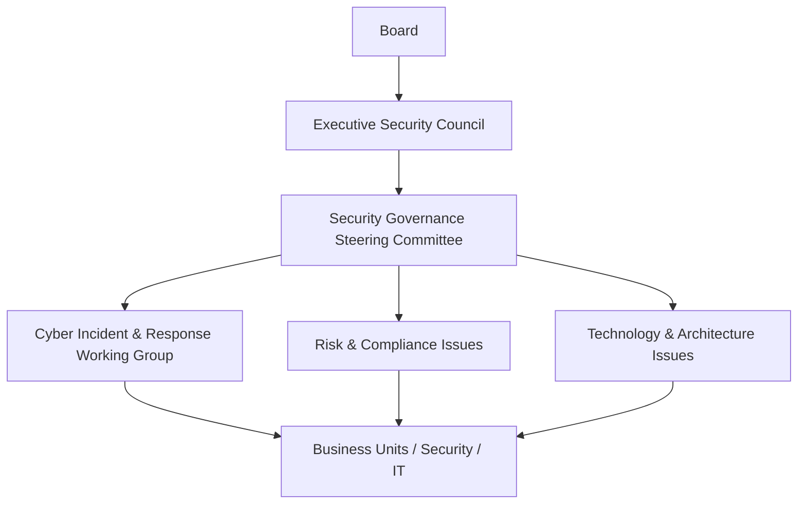

# GRC102 – Information Security Governance
## Week 3 Laboratory Report
### TechGlobal Security Governance Redesign

Prepared by: Olubunmi Adesanmi

Programme: GRC Engineering  

Course: GRC102 – Information Security Governance

Module - Module 3 – Roles and Responsibilities in Security Governance

Role: Lead Security Governance Consultant  

Submission Date: 25 September 2026  

---

## Table of Contents

1. [Executive Summary](#1-executive-summary)
2. [Introduction and Laboratory Context](#2-introduction-and-laboratory-context)
3. [Governance Design Principles](#3-governance-design-principles)
4. [Task 1 – Governance Architecture and Stakeholder Map](#4-task-1--governance-architecture-and-stakeholder-map)
5. [Task 2 – Governance Responsibility and Authority Matrix](#5-task-2--governance-responsibility-and-authority-matrix)
6. [Task 3 – Security Governance Committee Ecosystem](#6-task-3--security-governance-committee-ecosystem)
7. [Task 4 – RACI Accountability Matrix](#7-task-4--raci-accountability-matrix)
8. [Task 5 – Cyber-Risk Escalation and Segregation of Duties](#8-task-5--cyber-risk-escalation-and-segregation-of-duties)
9. [Implementation Roadmap](#9-implementation-roadmap)
10. [Expected Governance Outcomes](#10-expected-governance-outcomes)
11. [Conclusion](#11-conclusion)
12. [References and Framework Alignment](#12-references-and-framework-alignment)
13. [Appendices](#13-appendices)

---

## 1. Executive Summary

TechGlobal is a rapidly growing technology organisation with approximately 2,500 employees operating across five global offices. Although the organisation’s revenue and product adoption are increasing, its security governance arrangements have not matured at the same rate. Security decisions are largely concentrated with the IT Director, business units make inconsistent security decisions, formal governance committees are absent, and executive and Board visibility of cyber risk is limited.

This report presents a redesigned security governance model intended to move TechGlobal from an informal, IT-centric approach to a structured, business-aligned and accountable governance model.

The proposed model establishes clear separation between Board oversight, executive accountability, enterprise risk management, security governance, legal and regulatory advice, financial governance, people governance, technology delivery, and business-unit ownership.

The proposed governance structure introduces an Executive Security Council, a Security Governance Steering Committee, and a specialised Cyber Incident and Response Working Group. These forums create defined channels through which operational issues can be reviewed, escalated and resolved.

The report also establishes explicit responsibilities for the Board, CEO, CISO, CRO/Risk, Legal, Finance, HR, IT and Business Unit Leaders. A RACI model is used to clarify responsibility and accountability for fifteen critical governance activities.

A three-level cyber-risk escalation model is proposed: Level 1 – Operational; Level 2 – Executive; and Level 3 – Material/Board.

Finally, the report identifies segregation-of-duties weaknesses created by the current IT-centric model and proposes practical controls such as independent risk acceptance, separation between control implementation and assurance, cross-functional approval, independent legal assessment and Board-level oversight of material risk.

---

## 2. Introduction and Laboratory Context

TechGlobal is experiencing rapid organisational growth, increased revenue and increased product adoption. However, security governance has not developed at the same pace.

The current environment has several characteristics:

- security decisions are concentrated with the IT Director;
- there is no formal governance committee structure;
- business units make local security decisions inconsistently;
- security ownership is unclear;
- risk acceptance authority is not clearly separated from operational responsibility;
- the CEO and Board receive limited cyber-risk visibility; and
- escalation pathways are not formally defined.

The purpose of this report is to provide a complete security governance redesign for TechGlobal covering governance architecture, responsibility and authority, committee governance, RACI accountability, cyber-risk escalation and segregation of duties.

---

## 3. Governance Design Principles

### 3.1 Business Ownership
Cybersecurity should not be treated exclusively as an IT responsibility. Business units that own processes, systems, services and information should also own the business risks associated with those activities.

### 3.2 Clear Accountability
Every material governance decision should have a clearly identified accountable role. Responsibility may be distributed, but accountability should not be ambiguous.

### 3.3 Independent Risk Oversight
The individual or function responsible for implementing a security control should not independently approve the risk created by failure of that control.

### 3.4 Proportionate Governance
Governance should be strong enough to manage TechGlobal’s scale and complexity without creating unnecessary approval layers.

### 3.5 Escalation by Materiality
Not every security event should reach executives or the Board. Escalation should be based on defined criteria such as business impact, customer impact, regulatory exposure, financial exposure, operational disruption, data sensitivity and strategic significance.

### 3.6 Evidence-Based Decisions
Important security decisions should be supported by documented evidence, including risk assessments, recommendations, approvals, decision rationale, action owners and review dates.

### 3.7 Cross-Functional Decision Making
Security decisions with significant business, legal, financial, people or technology implications should involve the appropriate functions rather than being made by one department.

---

## 4. Task 1 – Governance Architecture and Stakeholder Map

### 4.1 Current-State Governance Assessment
TechGlobal’s current model can be described as an informal governance structure centred around the IT function. The IT Director effectively performs several different functions: security owner, risk decision-maker, operational decision-maker, technology authority and escalation point.

### 4.2 Governance Gap Assessment

| No. | Governance Weakness | Business/Risk Consequence | Required Improvement |
| --- | --- | --- | --- |
| 1 | Security authority concentrated in IT | Excessive concentration of decision-making and limited independent challenge | Establish CISO-led security governance with executive and Board oversight |
| 2 | No formal governance committees | Security decisions may be inconsistent and poorly coordinated | Establish Executive Security Council and Security Governance Steering Committee |
| 3 | Unclear risk acceptance authority | Risks may be accepted by people without appropriate authority | Define risk acceptance thresholds and delegated authority |
| 4 | Business units make inconsistent decisions | Different security practices and control maturity across the organisation | Establish common enterprise policies and governance standards |
| 5 | Limited Board visibility | Board may not have sufficient information about material cyber risks | Introduce regular Board cyber-risk reporting |
| 6 | Weak segregation of duties | The same person may implement, approve and assess controls | Separate implementation, risk acceptance and assurance |
| 7 | Informal escalation | Material issues may not reach executives quickly enough | Implement defined cyber-risk escalation thresholds |
| 8 | Limited cross-functional involvement | Legal, Finance, HR and business risks may be overlooked | Establish cross-functional governance committees |
| 9 | Unclear decision trail | Difficult to demonstrate why major security decisions were made | Establish formal decision logs and evidence requirements |
| 10 | Lack of structured governance cadence | Risk management becomes reactive rather than continuous | Introduce monthly, quarterly and annual governance activities |

### 4.3 Stakeholder Map

| Stakeholder | Authority / Influence | Primary Interest | Information Needed | Governance Contribution |
| --- | --- | --- | --- | --- |
| Board of Directors | Very High | Enterprise risk, resilience, reputation and accountability | Material cyber risks, trends, major incidents, risk acceptance, assurance | Provides oversight, challenges management and monitors material risk |
| CEO | Very High | Business performance, strategic risk and growth | Strategic cyber risks, significant incidents, investment needs | Provides executive accountability and resolves major business conflicts |
| CISO | High | Security governance and programme effectiveness | Security risk, controls, incidents, vulnerabilities, compliance | Leads security governance, strategy, policy and reporting |
| CRO / Risk | High | Enterprise risk integration | Cyber-risk exposure, risk treatment and accepted risks | Provides independent risk methodology and aggregation |
| Legal / Compliance | High | Regulatory and contractual exposure | Incidents, data exposure, obligations and evidence | Provides legal/regulatory advice and notification guidance |
| Finance | High | Financial exposure and investment | Cyber losses, security budget, investment priorities | Supports financial decisions, budgeting and loss analysis |
| Human Resources | Medium/High | People risk and workforce controls | Joiner/mover/leaver issues, awareness and conduct | Supports people-related security governance |
| IT / Technology | High | Secure technology delivery and continuity | Architecture, vulnerabilities, incidents and technology risks | Implements and operates technical controls |
| Business Unit Leaders | High | Business performance and operational continuity | Risks affecting their processes, systems and customers | Own business risks and implement required controls |

### 4.4 Proposed Security Governance Organisation Structure

```text
BOARD OF DIRECTORS
      |
      v
CEO
  +-----+-----+
  v           v
CRO/Risk    CISO
  v           v
Executive Security Council
    |
    v
Security Governance Steering Committee
    +-------+-------+
    |               |
    v               v
IT          Legal      Finance/HR
    |
    v
Cyber Incident & Response Working Group
    |
    v
Business and Technology Owners


```

### 4.5 Communication and Reporting Paths
Operational teams → Business/Technology Owners → Security Governance Steering Committee → Executive Security Council → CEO 

### 4.6 Consultant Justification
The proposed structure is appropriate for a 2,500-employee organisation because it creates enterprise consistency while allowing local operational teams to manage day-to-day activities. It separates governance from operational delivery and provides defined channels for risk escalation and Board visibility.

## 5. Task 2 – Governance Responsibility and Authority Matrix
### 5.1 Responsibility and Authority Model

| Code | Meaning | Description |
|---|---|---|
| **R** | Responsible | Performs or coordinates the work. |
| **A** | Accountable | Owns the final outcome or decision. |
| **C** | Consulted | Provides specialist advice or input. |
| **I** | Informed | Receives information. |

### 5.2 Governance Responsibility Matrix

| Role | Purpose | Core Responsibilities | Decision Authority | Reports / Escalates To | KPIs / Evidence |
|---|---|---|---|---|---|
| **Board** | Enterprise oversight | Cyber-risk oversight, risk appetite, material incidents and assurance | Oversight of material enterprise risk | CEO / Board committees | Board reports, material risk register |
| **CEO** | Executive accountability | Strategy, business alignment and major risk decisions | Executive decisions and strategic investment | Board | Risk treatment progress, major incident decisions |
| **CISO** | Security leadership | Security strategy, policy, risk oversight and programme effectiveness | Security governance recommendations and security standards | CEO / Executive Security Council | Control effectiveness, risk remediation, incident metrics |
| **CRO / Risk** | Enterprise risk integration | Risk methodology, aggregation and risk acceptance framework | Risk methodology and independent challenge | CEO / Board risk oversight | Risk register quality, overdue risks and accepted-risk monitoring |
| **Legal / Compliance** | Legal and regulatory advice | Regulatory obligations, contracts, privacy and notification | Regulatory interpretation and legal advice | CEO / Relevant Executive | Regulatory assessments and notification decisions |
| **Finance** | Financial governance | Budget, investment and financial exposure | Budget and financial control decisions within authority | CEO / Board | Budget variance and investment tracking |
| **HR** | People governance | Awareness, conduct, JML controls and disciplinary processes | People-related governance decisions | CEO | Training completion and JML compliance |
| **IT** | Technology delivery | Technical controls, architecture implementation and operations | Technical implementation within approved governance | Executive management / Governance | Patch performance and control implementation |
| **Business Unit Leaders** | Business ownership | Business risk, local controls and operational continuity | Business decisions within risk appetite | Executive management | Risk remediation and control compliance |

### 5.3 Role Profiles
Board of Directors: Provides oversight of material cyber risk and challenges management reporting.
CEO: Provides executive accountability for integrating cybersecurity with business strategy.
CISO: Leads enterprise security governance, strategy, policy, security risk oversight and reporting.
CRO/Risk: Ensures cybersecurity risk is integrated into enterprise risk management and provides independent challenge.
Legal/Compliance: Ensures security decisions consider legal, regulatory and contractual obligations.
Finance: Ensures security investments and losses are financially governed.
HR: Manages workforce-related security governance including awareness and joiner/mover/leaver controls.
IT/Technology: Implements and operates secure technology services.

### 5.4 Authority Boundaries

Enterprise security strategy – CEO / Executive Security Council.
Security standards – CISO.
Enterprise risk methodology – CRO/Risk.
Business risk ownership – Business Unit Leader.
Material risk acceptance – appropriate executive/Board authority based on threshold.
Technical implementation – IT.Enterprise security strategy – CEO / Executive Security Council.
Regulatory interpretation – Legal/Compliance.
Security budget – CEO/Finance within delegated authority.
Material incident governance – Executive Security Council / CEO.
Board cyber-risk oversight – Board.

### 5.5 Conflict Resolution
Three major conflicts are addressed: CISO vs Business Unit Leader on risk acceptance; CISO vs IT on security requirements versus technical feasibility; and CEO vs Legal on incident communications and regulatory considerations. The solution is documented authority, cross-functional review and formal decision records.

---

# 6.Task 3 – Security Governance Committee Ecosystem

## 6.1 Committee Architecture



### 6.2 Executive Security Council
Purpose: Provide executive-level strategic oversight and resolve matters exceeding operational authority.

Membership: CEO (Chair), CISO, CRO/Risk, IT, Legal/Compliance, Finance, HR where relevant, and selected Business Unit Leaders.

Responsibilities: Review material cyber risks, significant incidents, strategic priorities, major investments, risk treatment and Board escalation.

Frequency: Monthly, plus emergency meetings for material incidents.

### 6.3 Security Governance Steering Committee
Purpose: Cross-functional governance over security policies, risk, controls, compliance, architecture and operational priorities.

Membership: CISO (Chair), CRO/Risk, IT, Legal/Compliance, Finance, HR, Business Unit representatives and security specialists.

Frequency: Monthly.

### 6.4 Cyber Incident and Response Working Group
Purpose: Coordinate operational incident readiness, response, evidence preservation, recovery and lessons learned.

### 6.5 Business Unit Participation
Business Units nominate Security/Risk Representatives to communicate enterprise requirements, identify local risks, track remediation, escalate issues and participate in exercises.

### 6.6 Terms of Reference

Purpose: Cross-functional governance over cybersecurity risk, policy, controls, compliance and security-related business decisions.

Authority: Review, recommend, challenge and coordinate decisions within delegated authority.

Responsibilities: Monitor risk, review policies, incidents, third parties, architecture and compliance, and prepare executive reports.

Quorum: CISO/delegate, CRO/Risk/delegate, IT representative and one business representative; Legal/Compliance when relevant.

Frequency: Monthly.

Records: Agenda, minutes, decisions, actions, risk extracts and approval evidence.

### 6.7 Sample Committee Agenda

1.Opening and approval of previous minutes
2.Outstanding actions
3.Current cyber-risk profile
4.High and critical vulnerabilities
5.Security incidents and lessons learned
6.Third-party security risks
7.Policy exceptions
8.Security architecture matters
9.Compliance and regulatory issues
10.Security awareness performance
11.Business continuity and recovery readiness
12.Decisions required
13.Escalations
14.Board reporting items
15.Any other business
16.Action confirmation and close

## 6.8 Sample Decision Log

| Date | Decision / Issue | Decision Owner | Decision | Rationale | Actions / Owner | Review Date |
|---|---|---|---|---|---|---|
| 05/10/2026 | Critical vulnerability affecting externally exposed service | CISO / IT | Emergency remediation approved | Risk exceeded operational tolerance | IT to remediate and validate | 12/10/2026 |
| 05/10/2026 | Third-party security exception | BU Leader / CRO | Temporary exception approved with conditions | Business need justified short-term exposure | BU to implement compensating controls | 05/11/2026 |
| 05/10/2026 | Security awareness gap | HR / CISO | Mandatory targeted training approved | Completion below expected level | HR to implement programme | 05/11/2026 |

## 6.9 Twelve-Month Governance Calendar

| Month | Major Governance Activities |
|---|---|
| January | Annual cyber-risk assessment and strategy review |
| February | Security policy review and awareness planning |
| March | Third-party security review |
| April | Incident response exercise |
| May | Access governance review |
| June | Mid-year cyber-risk review |
| July | Business continuity and recovery governance review |
| August | Security architecture and vulnerability review |
| September | Board cyber-risk reporting deep dive |
| October | Third-party and supplier risk review |
| November | Annual incident lessons-learned review |
| December | Annual governance effectiveness review and next-year planning |

### Recurring Governance Activities

**Monthly:** Security governance committee, risk review, vulnerability review, incident trend review and remediation tracking.

**Quarterly:** Executive Security Council review, Board reporting, security metrics review and risk acceptance review.

**Annual:** Governance effectiveness assessment, strategy review, policy review, enterprise cyber-risk assessment and committee Terms of Reference review.

## 7. Task 4 – RACI Accountability Matrix
### 7.1 RACI Principles
R = Responsible
A = Accountable
C = Consulted
I = Informed
7.2 TechGlobal RACI Matrix
