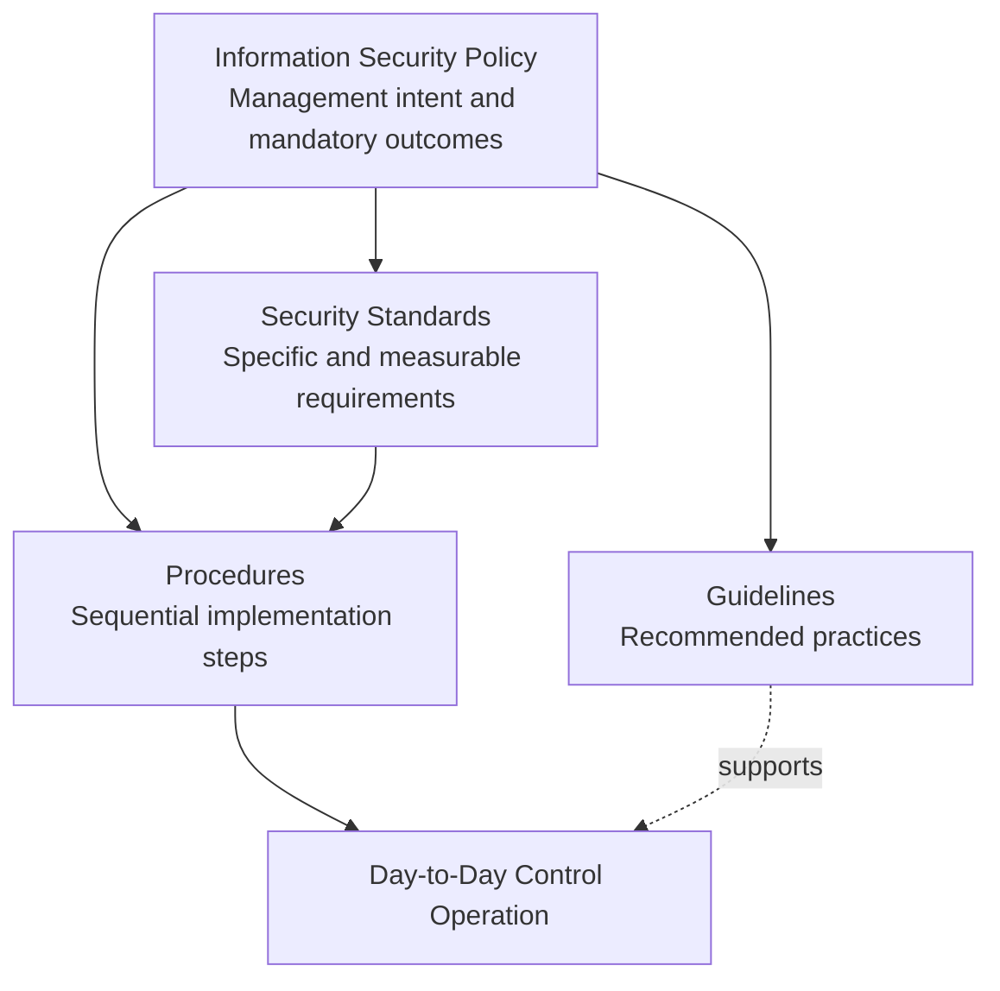

# 🛡️ GRC102: Information Security Governance

## NexusTech Solutions — Policy Overhaul Simulation

[](#project-status)
[](#project-overview)
[](#key-learning-outcomes)
[](#task-1-governance-blueprint)

> **Full Practical Laboratory Report**
 
> **Prepared by:** Olubunmi Adesanmi

> **Simulation Role:** Information Security Manager

> **Course:** GRC102 – Information Security Governance

> **Module** Module 2 – Developing Security Policies and Procedures

> **Assessment:** GRC102, Week 2 Practical Laboratory


## Lab Overview

This stimulation presents a professional information security governance practical laboratory completed for **GRC102 – Information Security Governance**, Module 2. The scenario places me in the role of **Information Security Manager** at NexusTech Solutions, a growing software company that requires a formal, structured and maintainable policy framework.

The project replaces an outdated and poorly structured “IT Rules” document with an integrated set of governance artefacts. The deliverables distinguish high-level policy intent from mandatory standards, operational procedures and recommended guidelines. They also address acceptable use, access provisioning, policy communication, training, exception management, enforcement and lifecycle maintenance.

## Business Problem

NexusTech Solutions has grown from 50 to 250 employees and serves clients in financial and healthcare sectors. Its existing five-year-old IT document combines management intent, technical configuration instructions and vague recommendations. This creates:

- inconsistent security practices;
- unclear ownership and accountability;
- unauthorised software and cloud-service risk;
- informal access provisioning;
- weak audit evidence;
- policy communication and adoption gaps; and
- readiness challenges for ISO/IEC 27001 and SOC 2.

## Lab Objectives

- Establish a policy hierarchy covering **Policies, Standards, Procedures and Guidelines**.
- Apply the Security Policy Development Lifecycle to a realistic organisation.
- Draft clear, concise and enforceable policy requirements.
- Translate access-control requirements into repeatable operational steps.
- Design communication, training, acknowledgement and escalation mechanisms.
- Establish exception, enforcement, review and maintenance arrangements.
- Produce management-ready artefacts suitable for a professional GRC portfolio.


## File Contents

```text
.
├── README.md
└── FINAL_REPORT.md
```

## Methodology

The work follows a practical policy-development lifecycle:


The approach emphasises:

1. **Governance alignment:** Clear ownership, approval authority and document control.
2. **Risk-based drafting:** Requirements respond to unauthorised software, informal access, cloud misuse and data leakage risks.
3. **Operational usability:** Procedures identify prerequisites, actions, decisions, approvals and retained evidence.
4. **Assurance:** Metrics, acknowledgement records, audit trails and review triggers demonstrate control operation.
5. **Maintainability:** Annual review and event-driven revision keep documents aligned with organisational change.

## Security Documentation Hierarchy



| Document Type | Core Question | Authority | Nature |
|---|---|---|---|
| Policy | What must be achieved and why? | Executive management | Mandatory |
| Standard | What specific baseline must be met? | Policy or control owner | Mandatory |
| Procedure | How is the requirement performed consistently? | Process owner | Mandatory when applicable |
| Guideline | What practice is recommended? | Subject-matter expert | Advisory |

## Key Governance Decisions

- Policy statements use enforceable language such as **must** and **shall**.
- Technical values and approved technologies are placed in standards rather than high-level policy.
- Step-by-step actions are documented as procedures.
- Advisory practices remain guidelines unless formally made mandatory.
- Access requests require an approved ticket, verified approvals, least privilege and retained evidence.
- Personal email and personal cloud storage must not be used for company or client information.
- Exceptions must be justified, risk-assessed, approved, time-bound and recorded.
- Policy adoption is measured through training, acknowledgement, knowledge checks and operational indicators.
- Annual policy review is supplemented by early-review triggers such as incidents, cloud migrations, audit findings and legal changes.

## Skills Demonstrated

- Information security policy development
- GRC documentation hierarchy design
- Acceptable Use Policy drafting
- Identity and access governance
- Least-privilege and segregation-of-duties analysis
- Security awareness and training planning
- Policy exception and enforcement design
- Audit trail and evidence specification
- Policy lifecycle and change management
- Management communication and professional reporting

## Framework Alignment

The project is conceptually informed by:

- ISO/IEC 27001:2022 information security management requirements;
- ISO/IEC 27002:2022 information security control guidance;
- NIST Cybersecurity Framework 2.0 governance concepts; and
- SOC 2 Trust Services Criteria concepts relevant to security and control assurance.

This academic simulation does not claim certification or reproduce proprietary standards text.


## Academic Integrity and Responsible AI

Microsoft Copilot and CHATGPT(Open aI) was used for brainstorming to support structuring, drafting and language refinement. I remains responsible for validating the governance decisions, understanding every artefact, checking source claims and making any disclosure required. NexusTech Solutions and the operational details in this report are part of a fictional academic scenario.


## License and Use

This report is intended for academic and professional portfolio presentation.
