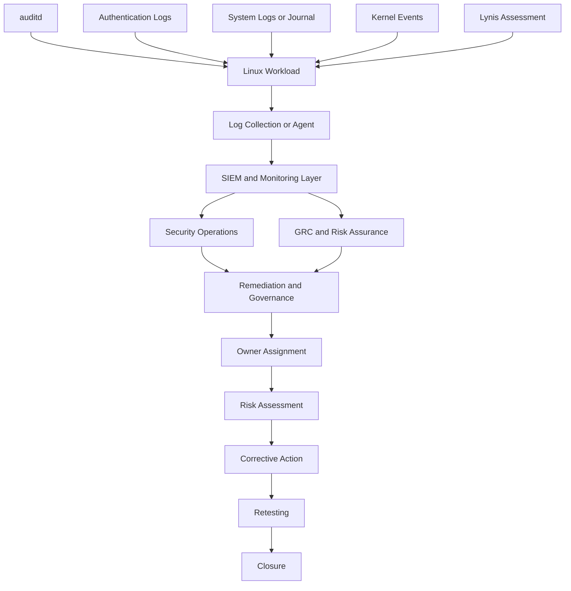
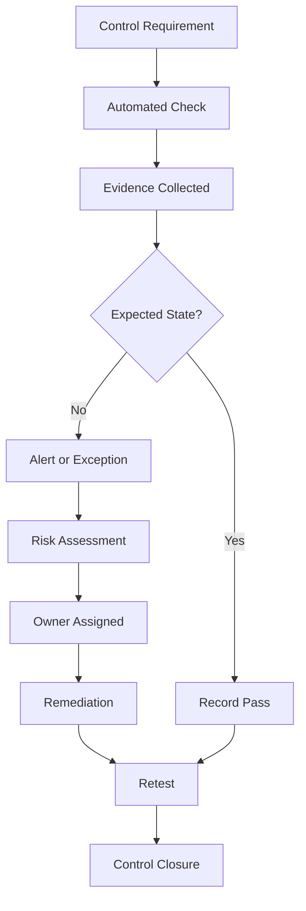

# Linux Security Monitoring, Auditing and Continuous Control Assurance


## GRC 102 Week 4 Laboratory Report

This report documents a practical **Linux security monitoring, auditing, and continuous control assurance assessment** completed for **GRC102: Information Security Governance** at the **International Cybersecurity and Digital Forensics Academy (ICDFA)**.

The project demonstrates how host-level technical evidence can be translated into control assessments, risk significance, ownership, remediation, retesting, and governance assurance.

---


| Field | Details |
|---|---|
| **Student** | Olubunmi Adesanmi |
| **Course** | GRC102: Information Security Governance |
| **Laboratory** | Linux Security Monitoring, Auditing and Continuous Control Assurance |
| **Assessment Type** | Practical Evidence and Governance Assurance Report |
| **Environment** | ICDFA Ubuntu Practice Hub / Authorised Training Environment |
| **Submission Date** | 2 October 2026 |


---

## Table of Contents

- [Executive Summary](#executive-summary)
- [Laboratory Overview](#laboratory-overview)
- [Objectives](#objectives)
- [Scope and Authorisation](#scope-and-authorisation)
- [Environment and Limitations](#environment-and-limitations)
- [Methodology](#methodology)
- [Module 1: Linux Auditing with auditd](#module-1-linux-auditing-with-auditd)
- [Module 2: Log Management and Analysis](#module-2-log-management-and-analysis)
- [Module 3: Linux Security Assessment with Lynis](#module-3-linux-security-assessment-with-lynis)
- [Consolidated Findings](#consolidated-findings)
- [Control Monitoring and Assurance](#control-monitoring-and-assurance)
- [Governance Escalation](#governance-escalation)
- [SIEM and Continuous Monitoring](#siem-and-continuous-monitoring)
- [Continuous Control Monitoring Design](#continuous-control-monitoring-design)
- [Remediation and Retest Plan](#remediation-and-retest-plan)
- [Evidence Register](#evidence-register)
- [Assurance Maturity Model](#assurance-maturity-model)
- [Conclusion](#conclusion)

---

## Executive Summary

This report presents the results of a Linux security monitoring and control-assurance assessment conducted on the authorised Ubuntu laboratory environment(Ubuntu Practical Hub) assigned for the GRC102 Week 4 practical laboratory. The assessment demonstrates how technical security evidence can be transformed into governance and assurance information.
The assessment covered Linux auditing using auditd, system and authentication-log analysis using journalctl and relevant Linux log sources, and security configuration assessment using Lynis. It also considered how host-level security evidence can contribute to enterprise monitoring, Security Information and Event Management (SIEM), Continuous Control Monitoring (CCM), automated alerting and governance reporting.
The assessment identified 3 significant findings requiring attention. The three principal evidence-based findings were:
1.Audit logging could not be fully verified because no active auditd process was identified and auditctl access was restricted in the Practice Hub environment.
2. Lynis identified one or more vulnerable packages requiring vulnerability assessment and remediation.
3. Lynis reported that klog was not running, which could lead to missing kernel messages in log files.
Each finding should be linked to the affected control objective, accountable owner, monitoring threshold, risk significance, remediation action and retesting requirement. The assessment demonstrates that technical evidence has greater assurance value when it is translated into a structured control-monitoring and follow-up process.  

This laboratory assessed three principal technical areas:

1. Linux audit capability using `auditd`.
2. System and authentication log analysis using `journalctl` and traditional log sources.
3. Security configuration assessment using Lynis.


### Key Results

| Area | Result | Assurance Status |
|---|---|---|
| `auditd` software | Installed | Partially verified |
| Active `auditd` process | Not identified | Needs Review |
| Kernel audit subsystem | Access denied or not permitted | Needs Review |
| `/var/log/auth.log` | Not available | Needs Review |
| `journalctl` evidence | No usable journal files or entries | Needs Review |
| Lynis version | 3.0.9 | Verified |
| Lynis executable | `/usr/sbin/lynis` | Verified |
| Hardening Index | 62 | Observed assessment indicator |
| Tests performed | 232 | Verified from scan output |
| Warnings | 3 | Needs Review |
| Suggestions | 43 | Improvement opportunities |


---

## Laboratory Overview

The laboratory provides hands-on experience in Linux security monitoring and auditing. Its purpose is not simply to execute Linux commands but to demonstrate how technical evidence can support governance, risk management, compliance and security assurance.
The assessment follows the principle:
Technical evidence → Control assessment → Risk significance → Ownership → Remediation → Retesting → Governance assurance
Linux systems generate security evidence through several mechanisms, including audit frameworks, authentication logs, system journals, kernel messages and configuration assessment tools. Such evidence is important because governance functions depend on reliable information to determine whether security controls are designed appropriately and operating as intended.
The laboratory therefore combines technical investigation with governance analysis.
The practical work covers:
auditd;
audit rules;
ausearch and aureport;
journalctl;
authentication and privilege-use logs;
general system logs;
Lynis;
SIEM concepts;
continuous control monitoring;
governance escalation;
remediation and retesting.
The assigned role for this assessment is:
Security Control Assurance Analyst
In this role, the objective is to examine available technical evidence, identify conditions requiring attention, determine the relevant control objective, identify an appropriate owner and establish a repeatable remediation and retest process.

Linux systems frequently support business-critical applications, infrastructure services and security-sensitive workloads. Effective governance therefore requires organisations to maintain reliable evidence that security controls are operating as intended.
This practical laboratory examined the relationship between Linux technical evidence and security governance. The assessment focused on audit records, system logs, authentication events and security configuration findings.

The laboratory combined technical investigation with governance analysis. Its overall assurance process was:

```text
Technical Evidence
        ↓
Control Assessment
        ↓
Risk Significance
        ↓
Ownership
        ↓
Remediation
        ↓
Retesting
        ↓
Governance Assurance
```

Linux security evidence can be generated through audit frameworks, authentication records, system journals, kernel messages, and security configuration assessment tools. Governance teams depend on this evidence to assess whether controls are properly designed, implemented, operating effectively, monitored, and auditable.

## Objectives

- Understand the purpose and role of `auditd`.
- Configure security-relevant audit rules
- Use `ausearch` and `aureport` conceptually for audit investigation.
- Use `journalctl`, `grep`, and traditional Linux logs to investigate events.
- Analyse authentication and privilege-use evidence.
- Perform a Linux security assessment using Lynis.
- Interpret warnings, suggestions, and hardening indicators.
- Translate technical observations into control-assurance findings.
- Assign ownership and remediation responsibilities.
- Define monitoring thresholds and retesting requirements.
- Explain how SIEM and automation support continuous control monitoring.

## Scope and Authorisation

### Scope

The assessment covered:

- Audit software availability and accessibility
- Authentication logging
- System journal and logging visibility
- Lynis security assessment
- Vulnerability-related findings
- Kernel logging
- Security hardening observations
- Governance and control-assurance implications

### Authorisation

All activity was confined to the authorised ICDFA training environment. No production infrastructure, external systems, or unauthorised devices were targeted. Testing was limited to inspection, audit commands, log review, configuration assessment, and benign monitoring.

---

### Limitations

1. The environment did not operate with `systemd` as PID 1.
2. The kernel audit subsystem could not be queried successfully.
3. No active `auditd` process was identified.
4. `/var/log/auth.log` was unavailable.
5. Journal files and entries were unavailable.
6. Live journal monitoring produced no events.
7. Complete audit and authentication evidence could not be established.

### Assurance Interpretation

The following results do not automatically prove equivalent production controls are ineffective:

- Failure to retrieve journal records
- Inability to query `auditctl`
- Absence of `/var/log/auth.log`
- Individual Lynis findings without validation

For this reason, affected controls are generally classified as **Needs Review**, rather than automatically declared non-compliant.

---

## Methodology

### Stage 1: Auditd Assessment

The auditd service was checked to determine whether Linux auditing was installed and operational. Custom audit rules were configured to monitor selected security-relevant activities. Audit events were queried using ausearch and summarised using aureport

```bash
sudo apt update
sudo apt install auditd audispd-plugins
sudo systemctl start auditd
sudo systemctl enable auditd

sudo nano /etc/audit/rules.d/custom.rules

-w /etc/passwd -p rwxa -k passwd_changes
-w /etc/shadow -p rwxa -k shadow_changes
-a always,exit -F arch=b64 -S execve -k program_execution
-a always,exit -F arch=b32 -S execve -k program_execution

```

### Stage 2: Evidence Collection
Linux Log Analysis
Systemd journal records and available traditional Linux log files were reviewed for system, SSH, authentication, sudo/privileged activity, errors and warnings. The objective was to distinguish routine activity from conditions requiring additional investigation or governance attention.

Available evidence was assessed using:

```bash
auditctl
journalctl
grep
ls
```

### Stage 3: Security Assessment

Lynis was used to identify warnings, suggestions, hardening indicators, vulnerability-related conditions, and logging weaknesses.

### Stage 4: Governance Translation

```text
Evidence → Control → Status → Risk → Owner → Remediation → Retest
```

---

# Module 1: Linux Auditing with auditd

## Installation Verification

```

## Kernel Audit Subsystem Verification

```bash
sudo auditctl -s
```

Observed result:

```text
you must be root to run this program
```

```bash
sudo auditctl -l
```

Observed result:

```text
Error sending rule data request (Operation not permitted)
There was an error while processing parameters.
```

## Audit Rules

The laboratory referenced example rules such as:

```bash
-w /etc/passwd -p rwxa -k passwd_changes
-w /etc/shadow -p rwxa -k shadow_changes
-a always,exit -F arch=b64 -S execve -k program_execution
-a always,exit -F arch=b32 -S execve -k program_execution
```

Where `/var/log/auth.log` exists:

```bash
-w /var/log/auth.log -p wa -k auth_failures
```

## Activity Assessment

| Item | Assessment |
|---|---|
| **Control objective** | Record security-relevant activity for accountability, monitoring, investigation, and assurance |
| **Observed condition** | Software installed; active process not identified; subsystem inaccessible; rules unverified |
| **Status** | **Needs Review** |
| **Governance significance** | Insufficient evidence to show that required audit records and rules operate effectively |

### Required Follow-up in a Supported Environment

```bash
sudo systemctl status auditd
sudo auditctl -s
sudo auditctl -l
sudo ausearch -k passwd_changes
sudo ausearch -k program_execution
sudo ausearch -k auth_failures
sudo aureport
sudo aureport --failed
sudo aureport --login
```

---

# Module 2: Log Management and Analysis

## Journal Review

```bash
sudo journalctl
sudo journalctl -u ssh
sudo journalctl --since "today"
sudo journalctl -p err
```

The environment returned no usable journal files or entries. This limited the assessment of recent activity, SSH events, errors, authentication events, services, and live monitoring.

## Authentication Log Review

```bash
ls -l /var/log/auth.log
```

Observed result:

```text
cannot access '/var/log/auth.log': No such file or directory
```

The correct assurance conclusion is not that authentication logging was definitely disabled. Instead, the expected evidence source was unavailable and an alternative logging mechanism would need to be identified.

## Activity Assessment

| Item | Assessment |
|---|---|
| **Control objective** | Ensure authentication, system, service, and security events are recorded and reviewable |
| **Observed condition** | No usable journal entries; traditional authentication log absent |
| **Status** | **Needs Review** |
| **Governance significance** | Limited ability to investigate activity, establish timelines, review privilege use, and demonstrate control operation |

---

# Module 3: Linux Security Assessment with Lynis

## Installation Verification

```bash
lynis --version
which lynis
```

Observed results:

```text
Lynis version 3.0.9
/usr/sbin/lynis
```

## Audit Summary

| Assessment Item | Observed Result |
|---|---:|
| Lynis version | 3.0.9 |
| Executable location | `/usr/sbin/lynis` |
| Hardening Index | 62 |
| Tests performed | 232 |
| Plug-ins enabled | 1 |
| Firewall scan | Enabled |
| Malware scanner | Not found |
| Compliance status | Not available |
| Security audit | Enabled |
| Vulnerability scan | Enabled |
| Warnings | 3 |
| Suggestions | 43 |

> The Hardening Index of **62** is a Lynis assessment indicator. It must not be represented as **62% compliant**. Formal compliance requires assessment against defined policies, standards, regulatory requirements, and documented control criteria.

## Finding 1: Vulnerable Packages

- **Condition:** One or more vulnerable packages were found.
- **Risk:** Potential exposure to known software vulnerabilities.
- **Proposed owner:** System Administrator / Vulnerability Management Owner.
- **Recommended action:** Identify affected packages, determine relevant vulnerabilities, assess exposure, apply approved updates, document exceptions, and rescan.
- **Status:** **Needs Review**.

## Finding 2: Name Server Configuration

- **Condition:** Two responsive name servers could not be found.
- **Risk:** Possible impact on resolution, connectivity, updates, monitoring, service availability, and dependencies.
- **Proposed owner:** System Administrator / Network Administrator.
- **Recommended action:** Review configured resolvers, connectivity, intended DNS architecture, and redundancy requirements.
- **Status:** **Needs Review**.

## Finding 3: Kernel Logging

- **Condition:** `klog` was not running, which could lead to missing kernel messages.
- **Risk:** Missing evidence for incident investigation, troubleshooting, monitoring, forensics, and control testing.
- **Proposed owner:** System Administrator / Linux Security Administrator.
- **Recommended action:** Identify the supported logging architecture, configure the appropriate mechanism, verify generation and retention, confirm retrieval, and rescan.
- **Status:** **Needs Review**.

## Notable Suggestions

1. Review whether an approved newer Lynis release is available.
2. Determine the runlevel and services enabled at startup.
3. Assess and harden applicable system services according to least functionality and approved standards.

---

# Consolidated Findings

| ID | Control Area | Observed Condition | Risk | Status |
|---|---|---|---|---|
| F-01 | Audit evidence availability | `auditd` installed, but process and rules unverified | Reduced accountability and investigation capability | Needs Review |
| F-02 | Authentication evidence | `/var/log/auth.log` unavailable | Authentication activity unverified through expected source | Needs Review |
| F-03 | System journal | No usable journal records | Reduced system and service visibility | Needs Review |
| F-04 | Vulnerability management | Vulnerable packages reported | Potential exposure to known vulnerabilities | Needs Review |
| F-05 | Kernel event logging | `klog` not running | Kernel messages may be absent from evidence | Needs Review |

---

# Control Monitoring and Assurance

| Control Area | Evidence | Proposed Owner | Monitoring Expectation | Remediation | Retest |
|---|---|---|---|---|---|
| Audit logging | Software installed; process and rules unverified | Linux/System Administrator | Required service and rules active and queryable | Configure in supported environment | Verify service, rules, and test events |
| Authentication monitoring | Expected log absent | System Administrator / Security Operations | Authentication events captured and reviewable | Identify supported log source | Perform controlled authentication test |
| System logging | Journal unavailable | System Administrator / Security Operations | Required logs generated, retained, and accessible | Confirm logging architecture | Repeat journal queries |
| Vulnerability management | Lynis vulnerable-package warning | Vulnerability Management / System Administrator | Remediate according to approved timelines | Identify, assess, and patch packages | Re-run Lynis |
| Kernel logging | Lynis reported `klog` not running | Linux/System Administrator | Kernel messages operational and retrievable | Configure supported mechanism | Verify logs and re-run Lynis |

---

# Governance Escalation

## Ownership Model

| Control Area | Primary Owner | Supporting Functions |
|---|---|---|
| Audit logging | Linux/System Administrator | Security Operations, GRC |
| Authentication monitoring | System Administrator | Security Operations, IAM |
| System logging | System Administrator | Security Operations |
| Vulnerability management | Vulnerability Management / Infrastructure | Security, GRC |
| Kernel logging | Linux/System Administrator | Security Operations |
| Governance oversight | Security Governance / GRC | CISO, Risk Management |


## Escalation Conditions

- Audit logging remains unavailable after remediation.
- Required audit rules cannot be verified.
- Security logs cannot be retrieved.
- Vulnerable packages remain unresolved beyond an approved period.
- Critical vulnerabilities are identified.
- Kernel or system logging remains unavailable.
- Monitoring failures recur.
- A control cannot produce sufficient assurance evidence.
- Remediation deadlines are exceeded.

---

# SIEM and Continuous Monitoring



Operational alerts may include repeated authentication failures, suspicious privileged commands, unusual process execution, system errors, service failures, and abnormal configuration changes.

Governance issues arise when control weaknesses become systemic, such as recurring audit failures, missing required logs, recurring vulnerabilities, unresolved high-risk findings, failed verification, impaired auditability, or repeatedly missed deadlines.

---

# Continuous Control Monitoring Design



### Audit Logging Example

- **Expected state:** `auditd` is running and approved rules are active.
- **Monitoring event:** The service stops or required rules disappear.
- **Automated response:** Generate an alert.
- **Governance response:** Create a control exception or security finding.
- **Remediation:** The System Administrator restores the approved configuration.
- **Verification:** Security or GRC reviews the evidence.
- **Closure:** Close only after successful retesting.

---

# Remediation and Retest Plan

| Finding | Remediation | Proposed Owner | Verification Evidence | Retest |
|---|---|---|---|---|
| Audit subsystem unavailable | Use supported environment; enable service and approved rules | System Administrator | Service status and rule output | `auditctl`, `ausearch` |
| Authentication evidence unavailable | Identify supported authentication source | System Administrator / Security Operations | Authentication event record | Controlled authentication test |
| Journal unavailable | Validate logging configuration and retention | System Administrator | Journal or log records | `journalctl` review |
| Vulnerable packages | Identify, assess, and patch affected packages | Vulnerability Management / System Administrator | Package and scan evidence | Lynis rescan |
| Name-server issue | Review DNS and resolver availability | Network/System Administrator | Configuration and resolution tests | Lynis rescan |
| Kernel logging | Configure supported kernel logging | Linux System Administrator | Kernel log evidence | Lynis rescan |
| Lynis release age | Review an approved update | Security/System Administrator | Version evidence | Repeat audit |
| Startup services | Review enabled services and justify need | System Administrator | Service inventory | Configuration review |
| Service hardening | Assess and harden applicable services | System Administrator | Before-and-after evidence | Lynis rescan |

---

# Evidence Register

| Evidence ID | Command or Check | Observed Result | Assurance Relevance |
|---|---|---|---|
| E-01 | `which auditd` | Executable path returned | Confirms installation |
| E-02 | `auditd -v` | Version information returned | Confirms software availability |
| E-03 | `dpkg -l \| grep auditd` | Package information returned | Confirms package installation |
| E-04 | `ps aux \| grep '[a]uditd'` | No output | No active process identified |
| E-05 | `sudo auditctl -s` | Root-related error | Subsystem not verified |
| E-06 | `sudo auditctl -l` | Operation not permitted | Rules not queryable |
| E-07 | `ps -p 1 -o pid,comm,args` | `1 sleep sleep infinity` | Confirms restricted environment |
| E-08 | `/var/log/auth.log` check | File not found | Authentication source unavailable |
| E-09 | `sudo journalctl` | No journal files or entries | Journal unavailable |
| E-10 | `sudo journalctl -u ssh` | No journal files or entries | SSH evidence unavailable |
| E-11 | `sudo journalctl --since "today"` | No journal files or entries | Current activity unavailable |
| E-12 | `sudo journalctl -p err` | No journal files or entries | Error evidence unavailable |
| E-13 | `lynis --version` | Lynis 3.0.9 | Confirms version |
| E-14 | `which lynis` | `/usr/sbin/lynis` | Confirms executable location |
| E-15 | Lynis audit | Hardening Index 62 | Security assessment indicator |
| E-16 | Lynis audit | 232 tests | Assessment scope |
| E-17 | Lynis audit | 3 warnings | Findings requiring review |
| E-18 | Lynis audit | 43 suggestions | Improvement opportunities |

---

# Assurance Maturity Model

| Stage | Assurance Question | Laboratory Observation |
|---|---|---|
| **1. Control Existence** | Does the tool or control exist? | `auditd` and Lynis were installed |
| **2. Control Operation** | Is the control operating? | `auditd` operation could not be verified |
| **3. Evidence Availability** | Can operation be demonstrated? | Several sources were unavailable |
| **4. Continuous Assurance** | Can the control be monitored continuously? | Requires supported collection and monitoring architecture |

A control is not fully assured merely because supporting software exists. Assurance requires evidence that it is appropriately configured, operating as intended, producing reliable evidence, monitored over time, and subject to remediation and retesting.

---

# Conclusion

The laboratory demonstrated how Linux technical evidence can be translated into governance and control assurance. Lynis was available and produced meaningful assessment results: version 3.0.9, 232 tests, a Hardening Index of 62, three warnings, and 43 suggestions.

The three key Lynis warnings concerned vulnerable packages, insufficient responsive name servers, and unavailable `klog` operation. The audit and logging assessment also found that an active `auditd` process could not be identified, the kernel audit subsystem could not be queried, `/var/log/auth.log` was unavailable, and `journalctl` produced no usable records.

These observations do not automatically prove that equivalent production controls are disabled. They demonstrate that the restricted training environment did not provide sufficient evidence to verify those controls fully. The affected controls should therefore be retested in an authorised, fully supported Ubuntu environment before definitive operational-effectiveness conclusions are made.

# References

CISOfy. (n.d.). Lynis documentation: Installation and usage guide. CISOfy. https://cisofy.com/documentation/lynis/

CISOfy. (n.d.). Lynis: Security auditing tool for Linux, macOS, and Unix-based systems. CISOfy. https://cisofy.com/lynis/

Dempsey, K. L., Chawla, N. S., Johnson, L. A., Johnston, R., Jones, A. C., Orebaugh, A., Scholl, M. A., & Stine, K. M. (2011). Information security continuous monitoring (ISCM) for federal information systems and organizations (NIST Special Publication 800-137). National Institute of Standards and Technology. https://doi.org/10.6028/NIST.SP.800-137

Linux man-pages project. (n.d.). Auditd(8) — The Linux Audit daemon. https://man7.org/linux/man-pages/man8/auditd.8.html

Linux man-pages project. (n.d.). Journalctl(1) — Print log entries from the systemd journal. https://man7.org/linux/man-pages/man1/journalctl.1.html

National Institute of Standards and Technology. (2020). Assessing information security continuous monitoring (ISCM) programs: Developing an ISCM program assessment (NIST Special Publication 800-137A). U.S. Department of Commerce. https://doi.org/10.6028/NIST.SP.800-137A

National Institute of Standards and Technology. (2020). Security and privacy controls for information systems and organizations (NIST Special Publication 800-53, Rev. 5). U.S. Department of Commerce. https://doi.org/10.6028/NIST.SP.800-53

Ubuntu. (n.d.). Aureport — A tool that produces summary reports of audit daemon logs. Ubuntu Manpages.

Ubuntu. (n.d.). Ausearch — A tool to query audit daemon logs. Ubuntu Manpages.

Ubuntu. (n.d.). Auditctl — A utility to assist controlling the kernel's audit system. Ubuntu Manpages.

## Academic Integrity, AI Use and Evidence Authenticity
The commands, screenshots and log evidence submitted  come from the authorised laboratory environment. Microsoft Copilot and CHATGPT(Open aI) was used for brainstorming to support structuring, drafting and language refinement of this report

---

## Author

**Olubunmi Adesanmi**  


## Disclaimer

This project was completed in an authorised training environment for educational and portfolio purposes. The findings relate to the assessed laboratory environment and must not be generalised to production systems without additional evidence and validation.
